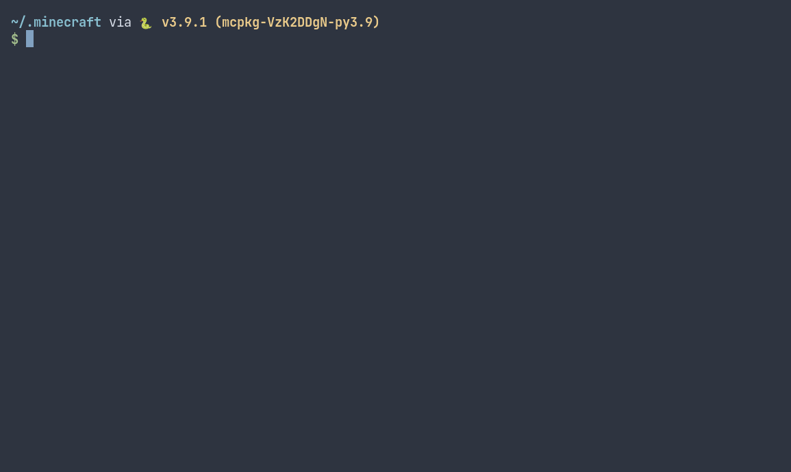

# mcpkg

Package manager for Minecraft datapacks, crafting tweaks, and resource packs



## Usage

```sh
mcpkg --help
```

Will give you a list of commands that can be run. Certain commands like `mcpkg list --installed` and `mcpkg install <name>` can only be run inside of a Minecraft world folder. By default your Minecraft worlds are located in `.minecraft/saves`.

## Installation

### Dependencies

- **Python 3.9:** If you're on linux or macOS, you should install from your package manager. If you're on Windows, you can install python from [their site](https://www.python.org/)

### Installing the cross-platform way

The easiset and most recommended way to install mcpkg is with `pip`

```sh
pip install mcpkg
```

## Road-map

### Pre-release Version 0.1

- [ ] Install support for crafting tweaks
- [x] Install support for data packs
- [x] Search using regular expressions
- [x] Listing installed packs in a particular world folder
- [x] Upgrading packages that are out of date
- [x] Out-of-date notifications
- [ ] Prompting the user to auto-update all out-of-date packages

### Release Version 1.0

- [ ] Completions
  - [ ] Bash
  - [ ] ZSH
  - [ ] Fish
  - [ ] Powershell
- [ ] Install support for resource packs on server machines
- [ ] Install support for resource packs on client machines

## FAQ

Answers to a few questions that may crop up regarding this tool:

### Why use a command line over a GUI app?

This project is aimed mostly at server admins, not end-users. It is very difficult to co-ordinate GUIs with Minecraft servers as they are usually on a different PC to the operator. If you are looking for a way to easily install datapacks with a graphical user interface, might I recommend the API that this tool is built around; [vanillatweaks.net](https://vanillatweaks.net/).

### How can you be sure that this project won't just die just like every package manager before?

All things tend towards entropy. But we have the advantage that the core database and logic is already maintained by a well-proven team, and is already in use by many Minecraft server owners and client users. Ideally the only way this tool will stop working, is if nobody is working on Vanilla Tweaks.

### How can I submit my own packs?

We're just the messenger. This is not the place to submit packs. Please see [vanillatweaks.net](https://vanillatweaks.net/)

### Can I help make this better?

Yes! This is GitHub, make an account if you don't have one already. Clone the repo or make an [issue](https://github.com/CRISPYricePC/mcpkg/issues/new/choose) at the top, we'll be happy to help

## Developing on VSCode

mcpkg uses poetry; a Python virtual environment. To make sure you're running in the virtual environment, run:

```sh
poetry env info -p
```

to get the virtual environment path. Then edit `.vscode/settings.json`:

```json
"python.pythonPath": "<output of poetry env info -p>/bin/python3",
"python.analysis.stubPath": "<output of poetry env info -p>/lib/python3.9/site-packages",
```
